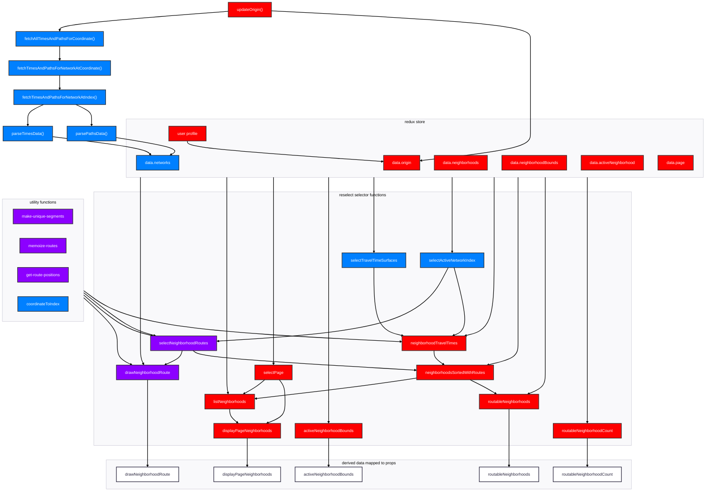
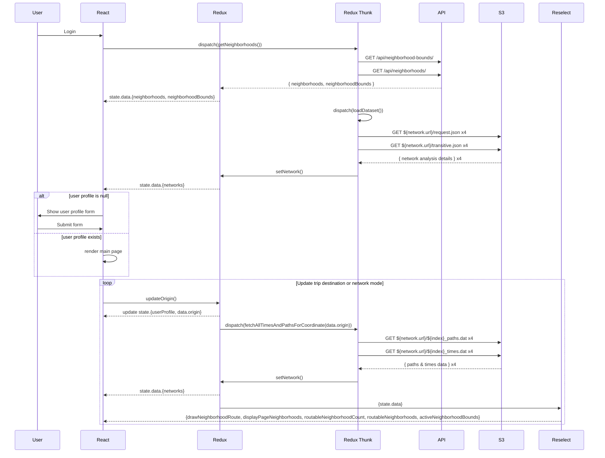

# 08-2025 Frontend State Management Migration Plan

## Context

[Following the routing evaluation in #600,](https://github.com/azavea/echo-locator/issues/600#issuecomment-2716360760) we are rewriting the frontend to move away from the forked Taui setup. This document outlines the immediate technical plan for migrating the state management as it relates to trip routing and neighborhood rankings, focusing on which existing logic is critical to bring over and how the new state flow will be structured.

The core functionality we need to preserve is the ability to fetch, parse, and utilize the Conveyal-generated static network analysis files to calculate transit routes and then score and sort neighborhoods with the ranking algorithm. The existing implementation of this logic is complex and tightly coupled to unmaintained libraries, making it a significant source of technical debt. The goal is to extract the essential, proven algorithms while re-architecting the state management for better performance, maintainability, and team familiarity.

## Decision

We will migrate the necessary logic from the old codebase into a new, streamlined state management system using [Redux Toolkit](https://redux-toolkit.js.org/), [Reselect (included by default in RTK)](https://github.com/reduxjs/reselect?tab=readme-ov-file) and [Redux Thunk (included by default in RTK)](https://github.com/reduxjs/redux-thunk).

### Rationale

  - **Retaining Proven Logic**: The core logic for fetching and parsing the Conveyal files is functional and integral to how the algorithm creates the accessibility score. In the existing codebase, the logic largely happens within `reselect` selector functions, deriving data from state and then mapping the calculated results to props. A potential [alternative encouraged by RTK is `proxy-memoize`](https://redux.js.org/usage/deriving-data-selectors#proxy-memoize`) that may be a better fit to handle a data-heavy frontend. However, this is the most complex part of the app so keeping the same tooling with more clear references to the old codebase will be helpful for future troubleshooting. Continuing with `reselect` will be easier to reason about for immediate migration work as well.
  - **Improved Maintainability**: By removing unmaintained Conveyal dependencies (e.g. `conveyal/woonerf`, `lonlat`, `gridualizer`) and unused features from Taui fork (e.g. `grids`, `pointsOfInterest`, `opportunities`), we will create a more focused and readable codebase.
  - **Team Familiarity**: Sticking with `redux-toolkit`, `reselect`, and `redux-thunk` leverages existing team knowledge. While other libraries like `proxy-memoize` or `RTK Query` exist, we already have a learning curve with `react-aria` and `tailwind-variants` as part of this rewrite so introducing another new tool with less familiarity is an unnecessary complexity.
  - **Enhanced Performance**: The new state flow will prevent unnecessary API calls and redundant calculations as well as take advantage of memoizing derived data using `reselect`.

### Technical Implementation

We already have a flow chart illustrating how neighborhood routing details and scores are derived, [here](https://github.com/azavea/echo-locator/issues/600#issuecomment-2776644000). Below is an expansion of that flowchart detailing specific state and functions from the old codebase that are necessary to bring forward to support functionality. Blue nodes are functions sourced from Taui, red nodes are our additions, and purple nodes are Taui functions adapted to support ECHO:

***Note diagram relationships between specific state values in redux and the selectors they trigger created a mess of arrows so there are only broad store-->selector arrows below. Those relationship details are available in mermaid diagram inline comments.***

There's an opportunity to setup a more efficient state management flow following the removal of vestigial taui functionality. The following sequence diagram illustrates a potential state management plan for the above neighborhood ranking and routing logic:

### Updates to State Flow & Logic

  - **Thunk Actions**: We will consolidate data fetching into thunk actions triggered on initial page load or when a user's trip destination or network mode changes. The old codebase used Conveyal's `woonerf` to manage data fetching which is no longer maintained and was difficult to troubleshoot. We will fetch neighborhood data, bounds, and the initial network files upfront since these remain static resources we use directly or to derive data. A separate thunk will be created to fetch trip-specific network data when the origin changes. This refactoring eliminates redundant API calls and ensures we have all the necessary data to create aggregated commute time ranges.
  - **Selectors**: We will bring over and refine the logic from the following core selectors and their dependent selectors and utility functions as needed:
      - `drawNeighborhoodRoute`: Creates the route segments to render on the map.
      - `displayPageNeighborhoods`: List of neighborhood details sorted by their ranking. Note that unroutable neighborhoods were removed from this list in the old codebase. In the new designs we keep all neighborhoods in the list but conditionally style based on if routable.
      - `routableNeighborhoodCount`: Number of neighborhoods with a calculated route. May no longer be necessary in new design.
      - `routableNeighborhoods`: Used to draw and style neighborhood bounds. Note this will likely need adjustment as un-routable neighborhoods were not rendered on map, we will now show all neighborhoods but conditionally style.
      - `activeNeighborhoodBounds`: Updates the map view to style the selected neighborhood

## Consequences
 - More intentional state management flow will be easier to maintain and align with team best practices. By only migrating the necessary logic, we reduce technical debt and set a foundation for adding new features or refining the algorithm, if needed.
- The migration requires careful, manual porting of the existing logic. This phase will require significant development and testing effort to ensure the accuracy of all calculations and the integrity of the displayed data. Since there are no existing frontend tests we should create scenarios (a given address + user profile settings + network mode) with 2020 analysis data and the old codebase to test against new implementation.
