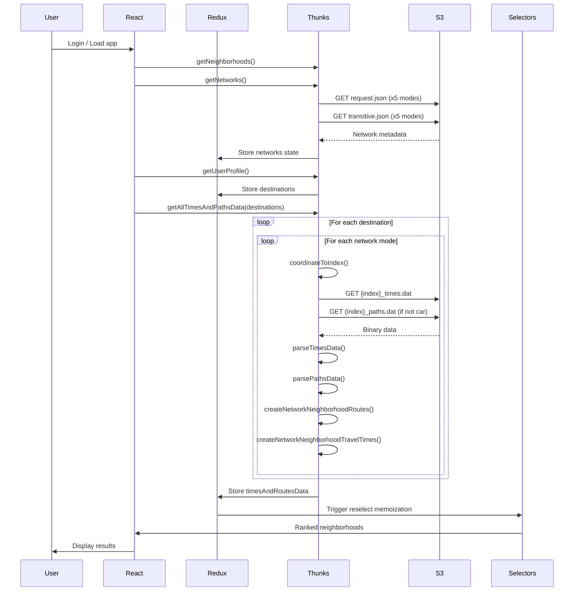

# Transit Routing Architecture

ECHO Locator uses transit network analysis data generated by
[Conveyal](https://www.conveyal.com/) to calculate travel times and routes by
transportation and traffic type. The travel times and routes are then used, in
combination with user-defined commute settings, to create accessibility scores
for recommendations and to display commute time and transit route paths for each
neighborhood.

This document outlines the frontend transit routing structure following the
migration from the initial Taui implementation, planned in the
[state management planning ADR](https://github.com/azavea/echo-locator/blob/develop/doc/arch/adr-003-state-management-migration.md).
A bulk of the core networks migration work and discussions can be found in the
migration PR, [PR #693](https://github.com/azavea/echo-locator/pull/693) as well
as [PR #699](https://github.com/azavea/echo-locator/pull/699). As a post-hoc ADR
documenting transit routing decisions, this document is organized by the core
steps that enable the frontend to work, bottom-up: Transit network analysis
source data --> transit network state management --> component use of transit
network state.

## Network analysis files

The network analysis files are pre-computed transit accessibility datasets that
enable the application to rank neighborhoods based on travel accessibility
without API calls. The application supports the five below network modes, each
representing different travel scenarios that may affect commute estimates (and
therefore neighborhood rankings) differently. Note that “peak” can be defined as
times with high commute demand and traffic congestion, e.g. afternoons
4:30-6:30pm.

| **Mode Key**       | **Label**           | **Includes Commuter Rail** | **Description**                                           |
| ------------------ | ------------------- | -------------------------- | --------------------------------------------------------- |
| `peak`             | Peak                | Yes                        | Peak hours with commuter rail and express bus service     |
| `offPeak`          | Off Peak            | Yes                        | Off-peak hours with commuter rail and express bus service |
| `peakNoExpress`    | Peak No Express     | No                         | Peak hours without commuter rail or express buses         |
| `offPeakNoExpress` | Off Peak No Express | No                         | Off-peak hours without commuter rail or express buses     |
| `car`              | Car                 | N/A                        | Driving times (no routing path)                           |

**NOTE** Route path results are not available for the car network mode. However,
basic travel time results are available and we can continue to use that data for
commute times and to generate a neighborhood accessibility score. By default,
driving speeds will not reflect congestion and will therefore generally
overstate access.

The network analysis data is static and hosted remotely on S3 in the
`echo-locator-analysis-files` bucket, organized by year of analysis generation
and then by network type. Each network type directory contains the following:

1. `request.json`: Network configuration and spatial metadata
2. `transitive.json`: Transit network topology, route segment and stop
   information
3. `{index}_times.dat`: Time surface binary data object for a given index.
   Indices are dynamically created on the frontend via the `coordinateToIndex()`
   function.
4. `{index}_paths.dat`: Paths grid binary data object for a given index. Not
   present for the car network mode. Indices are dynamically created on the
   frontend via the `coordinateToIndex()` function.

ECHO does not have a set cadence for updating transit networks data. The
neighborhood recommendations rely on accessibility analysis vs real-time
routing, so we are not reliant on updating frequently. However, after a few
years, we may need to have Conveyal re-generate new files on the latest street
network and transit data to capture broader accessibility changes. The steps to
update the network analysis include:

1. Ask our Conveyal point-of-contact to re-generate the analysis results with
   recent MBTA schedules for peak, off-peak, peak (no commuter rail/express
   bus), and off-peak (no commuter rail/express bus) network types as well as
   for driving.
2. Create a new directory in the `echo-locator-analysis-files` S3 bucket for the
   current year
3. Within the current year directory, create five sub-directories for each
   network mode following the naming conventions from the other year directories
4. Ensure CloudFront CORS headers allow frontend read-only access to updated
   year path
5. Once analysis files are generated from Conveyal they will be available in
   their own public S3 buckets for us to copy over. Use `aws cli` or `s5cmd` to
   sync buckets.
6. Update the `NETWORK_URL_ROOT` env variable path to point to the latest year
   bucket directory in the `dotenv` file for both staging and development, in
   the `echo-locator-stgdjango-config-us-east-1` and
   `echo-locator-devdjango-config-us-east-1` buckets respectively.
7. When ready to release with new transit network data, trigger the deployments
   on staging and production so that the new frontend bundle includes the
   updated `NETWORK_URL_ROOT` env var

**POTENTIAL ISSUES**

- The frontend processes the path and times data via parser functions migrated
  from Taui. The functions use a `DataView` object to read the binary data
  sequentially. A `byteOffset` variable tracks the current position in the
  buffer, advancing after each read operation by the number of bytes consumed.
  If there are changes to the incoming `*_paths.dat` and `*_times.dat` that
  affect the `byteOffset`, it could cause a misalignment that returns corrupted
  paths and stops IDs which hangs the application. This happened in the 2025
  analysis file update and a fix and troubleshooting notes are available
  [here](https://github.com/azavea/echo-locator/issues/628#issuecomment-3184615811).
- The `.dat` files are `application/octet-stream` files, which CloudFront does
  not compress by default. These files are already gzipped at source and
  downloading will decompress the files, which causes performance issues once
  the application is fetching times and paths data. To avoid this, we must
  always copy/sync directly from the source bucket when updating analysis files.
  See [Issue #629](https://github.com/azavea/echo-locator/issues/629) for more
  details.

## Networks State Management

Every network type’s `request.json` and `transitive.json` files are fetched on
login and stored in `networks` redux state by network mode. Once a user profile
is fetched and user destinations are known, the `getAllTimesAndPathsData` thunk
function is dispatched. This async thunk fetches and processes route paths and
travel times for every destination for each network and stores the results in
redux state (`networks.timesAndRoutesData`). This process is illustrated by the
below sequence diagram:



## Networks Use In Application

The `timesAndRoutesData` state provides two critical features: travel time and
route path segments. This data is used to create:

- The accessibility weight in the neighborhood recommendation algorithm
- Commute ranges for each neighborhood
- Transit route paths rendered on the neighborhood details map.

The commutes times, accessibility weight, and route paths will re-render if a
user changes the destination or travel settings. Changes to travel settings will
trigger a new active network mode conditionally dependent on the following
travel setting values: `userProfile.hasVehicle`, `userProfile.useCommuterRail`,
`networks.trafficConditions`.

| **Mode**           | **hasVehicle** | **useCommuterRail** | **trafficConditions** |
| ------------------ | -------------- | ------------------- | --------------------- |
| `peak`             | False          | True                | “peak”                |
| `offPeak`          | False          | True                | "offPeak"             |
| `peakNoExpress`    | False          | False               | “peak”                |
| `offPeakNoExpress` | False          | False               | "offPeak"             |
| `car`              | True           | False               | N/A                   |

The active network mode can be used (with the `userProfile.activeDestination`
state value and a neighborhood zipcode) to index times and routes data from
`networks.timesAndRoutesData` state.

For example, to access the commute time to a given neighborhood in state:

```ts
networks.timesAndRoutesData[destination][networkMode].travelTimesByNeighborhood[
    neighborhoodIndex
];
```

The time and route state is structured in this way to support easily creating
commute ranges (the min and max travel time values across network modes) for
each destination as well as for rendering route paths to multiple destinations
side-by-side in the neighborhood details modal.

### Neighborhood recommendation algorithm

Selector reference: `neighborhoodsSortedWithRoutes`

The algorithm measures neighborhood accessibility by evaluating a neighborhood’s
travel time and routability.

The neighborhood is routable if:

- The active network mode is “car”
- The active network mode is not “car” but there are transit route path segments

The neighborhood can only be recommended if:

- The neighborhood is routable and the travel time for the active network mode
  is less than 120 minutes (the maximum valid transit time)

**NOTE**: Evaluating neighborhood routability this way causes issues in specific
scenarios where a neighborhood centroid might be close enough to a user
destination that there are no transit stops in between. In this scenario the
neighborhood and destination are close enough that the route is “walkable” but
not technically “routable” by transit. This incorrectly bins neighborhoods in
the “not recommended” list even if they are accessible and have very small
commute times. In the future we should refine this process to better capture
exclusively "walkable" neighborhoods.

If a neighborhood is routable and its travel time for the active network mode is
under the maximum commute time (120 minutes) its commute time is used to create
the `accessibilityWeight` used in the final neighborhood score and then added to
the recommended list to be sorted.

### Transit route map display

Selector reference: `drawNeighborhoodRoutes`

Routes are generated by neighborhood for each network type (with the exception
of “car”) as part of processing the analysis files and setting networks state,
in `createNetworkNeighborhoodRoutes`. The correct route is indexed by active
neighborhood for a given network mode in the `drawNeighborhoodRoutes` selector
which then creates the GeoJSON FeatureCollection to display on the neighborhood
details map from its stops and segments.

- If a neighborhood → destination is not routable (ie, there are no route path
  segments): the selector will return a FeatureCollection of two Points (the
  origin and destination) and one LineString to between the two points (styled
  as the default, “walking”).
- If a neighborhood → destination is routable (ie, there are route path
  segments): the selector will return a FeatureCollection of two Points (the
  origin and destination), one LineString to the first stop (styled as the
  default, “walking”), a Point for each transit stop, and a Polyline of styled
  transit path segments between each stop.

The transit LineStrings are populated with properties, like `routeColor` and
`name`, in the selector logic which is then used to dynamically render styled
routes and transit line directions over the map. These feature properties are
derived from the segments themselves, which are enriched during the data
processing pipeline in `createNetworkNeighborhoodRoutes()`:

- `routeColor` and `name`:
    - Populated by looking up the `patternId` in the networks state for that
      network type (attributes set from a network’s `transitive.json` file)
    - Pattern → Route ID → Route details (color, name)
- `fromStop` and `toStop`:
    - Populated by indexing by Stop IDs in the networks state for that network
      type (attributes set from a network’s `transitive.json` file)
    - Uses `boardStopId` and `alightStopId` from parsed paths data
    - Retrieves full stop details including name, coordinates, and ID
